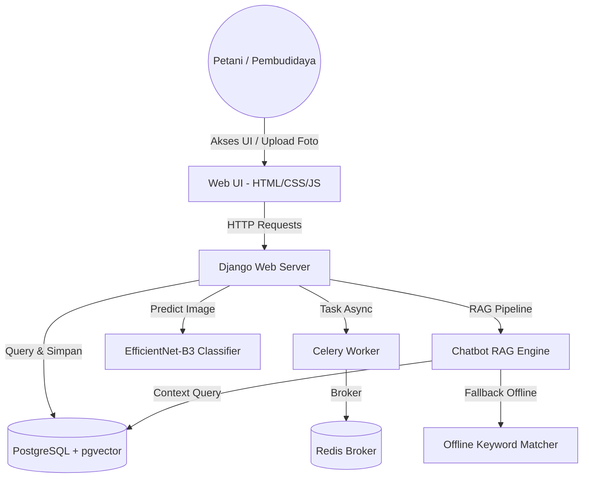
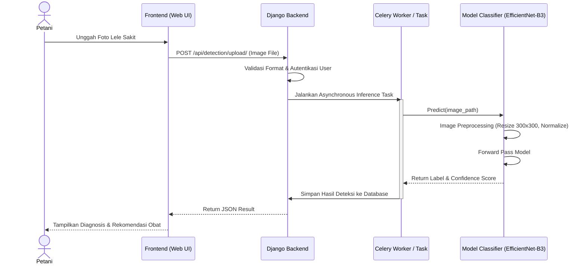
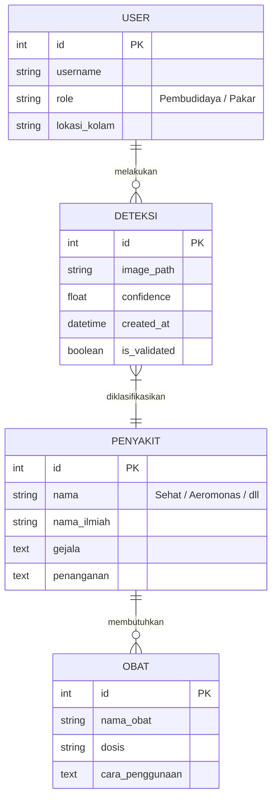
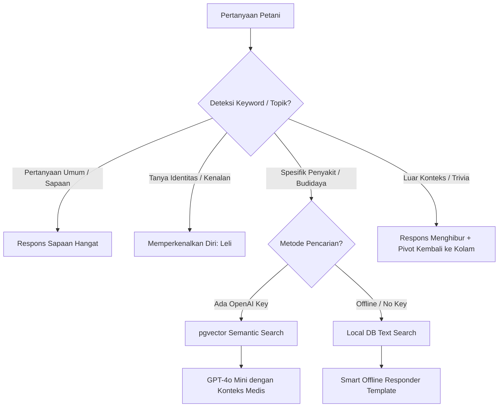

# Ternak Lele — Smart Aquaculture Platform 🐟✨

Platform web cerdas terintegrasi berbasis AI untuk deteksi penyakit ikan lele dan asisten budidaya digital. Platform ini menggunakan teknologi **Computer Vision** untuk diagnosis penyakit klinis lele secara visual dan **RAG Chatbot** sebagai asisten interaktif petani.

---

## 📖 DAFTAR ISI
1. [Product Requirement Document (PRD)](#1-product-requirement-document-prd)
2. [Software Requirement Specification (SRS)](#2-software-requirement-specification-srs)
3. [Arsitektur & Diagram UML](#3-arsitektur--diagram-uml)
4. [Struktur Folder & Penjelasan File](#4-struktur-folder--penjelasan-file)
5. [Detail & Logika Sistem AI](#5-detail--logika-sistem-ai)
   - [AI Deteksi Penyakit (EfficientNet-B3)](#a-ai-deteksi-penyakit-efficientnet-b3)
   - [Asisten AI RAG (Chatbot Leli)](#b-asisten-ai-rag-chatbot-leli)
6. [Setup & Panduan Instalasi](#6-setup--panduan-instalasi)
7. [Panduan Training & Evaluasi Model](#7-panduan-training--evaluasi-model)

---

## 1. PRODUCT REQUIREMENT DOCUMENT (PRD)

### 1.1 Latar Belakang & Masalah
Budidaya lele sering menghadapi risiko kematian massal akibat serangan penyakit yang lambat terdeteksi. Petani lele pemula sering kesulitan mengidentifikasi gejala klinis secara akurat dan salah memberikan penanganan obat, yang menyebabkan kerugian finansial yang signifikan.

### 1.2 Visi & Tujuan Produk
Menghadirkan platform asisten digital yang mampu mendeteksi kondisi kesehatan lele secara instan melalui foto smartphone petani, memberikan edukasi penanganan yang presisi, dan menyediakan ruang konsultasi AI interaktif (Chatbot) secara real-time.

### 1.3 Target Pengguna
*   **Pembudidaya Lele**: Pengguna utama yang mengunggah foto lele sakit untuk diagnosis cepat dan mencari artikel panduan kolam.
*   **Pakar Perikanan**: Pengguna profesional yang memvalidasi hasil deteksi AI demi akurasi klinis 100%.

### 1.4 Fitur Utama (Core Features)
1.  **Deteksi Penyakit AI**: Upload foto lele -> Klasifikasi kondisi (Sehat, Aeromonas, Malnutrisi, Jamur, Overfeeding).
2.  **Direktori Edukasi (Knowledge Base)**: Informasi lengkap tentang gejala, penyebab, penanganan, pencegahan, dan obat-obatan terdaftar.
3.  **Chatbot AI "Leli"**: Asisten interaktif 24/7 dengan pendekatan natural yang menguasai modul budidaya lele dan mampu menjawab pertanyaan santai.
4.  **Validasi Pakar**: Pengiriman diagnosis AI ke pakar perikanan terdaftar untuk konfirmasi lebih lanjut.
5.  **Riwayat Kesehatan Kolam**: Laporan riwayat unggahan deteksi petani.

---

## 2. SOFTWARE REQUIREMENT SPECIFICATION (SRS)

### 2.1 Spesifikasi Fungsional (Functional Requirements)
*   **FR-1 (Autentikasi)**: Sistem harus mendukung registrasi dan login multi-role (Pembudidaya & Pakar).
*   **FR-2 (Deteksi Citra)**: Sistem harus dapat menerima unggahan file gambar (`.jpg`, `.png`, `.jpeg`) beresolusi hingga 10MB untuk diproses oleh model klasifikasi AI.
*   **FR-3 (Response Cepat)**: Deteksi AI harus diselesaikan secara asynchronous (menggunakan task runner) atau langsung di-cache untuk menghindari request timeout.
*   **FR-4 (Chatbot RAG)**: Sistem chatbot harus mampu mengekstrak konteks artikel pengetahuan lokal sebelum memberikan jawaban ke pengguna.

### 2.2 Spesifikasi Non-Fungsional (Non-Functional Requirements)
*   **NFR-1 (Akurasi Model)**: Akurasi klasifikasi penyakit pada data validasi harus mencapai **≥ 95%**.
*   **NFR-2 (Waktu Inferensi)**: Waktu respons deteksi AI pada satu citra harus di bawah **2.0 detik** di lingkungan CPU.
*   **NFR-3 (Hot-Reloading)**: Pembaruan model `.pth` harus langsung dimuat oleh sistem Django tanpa memerlukan restart layanan web.
*   **NFR-4 (Keamanan Data)**: Komunikasi API dilindungi oleh token JWT atau sesi Django yang terenkripsi.

---

## 3. ARSITEKTUR & DIAGRAM UML

### 3.1 Arsitektur Sistem (High-Level Architecture)
Platform ini dibangun dengan pola arsitektur **Django Monolith** dengan decoupling logic pada layer kecerdasan buatan (AI) dan task queue.



### 3.2 Diagram Alir Deteksi AI (Sequence Diagram)
Diagram ini menjelaskan proses dari unggahan foto lele hingga hasil klasifikasi ditampilkan.



### 3.3 Relasi Database (ERD Singkat)
Struktur data utama yang menghubungkan akun, deteksi, dan basis pengetahuan.



---

## 4. STRUKTUR FOLDER & PENJELASAN FILE

```
ternaklele/
├── config/                     # Konfigurasi Utama Django
│   ├── settings/
│   │   ├── base.py             # Pengaturan umum & AI_CLASS_LABELS
│   │   └── development.py      # Pengaturan database lokal
│   ├── celery.py               # Konfigurasi Task Queue Celery
│   ├── urls.py                 # Routing URL Global
│   └── wsgi.py                 # Python WSGI Entrypoint
├── apps/                       # Aplikasi Fitur Modular Django
│   ├── accounts/               # Sistem Auth (User, Pakar, Kredensial)
│   ├── detection/              # Fitur Deteksi AI, Views, & Tasks
│   │   ├── tasks.py            # Task inferensi async Celery
│   │   └── views.py            # API unggah & histori deteksi
│   ├── chatbot/                # Pipeline Chatbot RAG Leli
│   │   ├── views.py            # Endpoints chat session & messaging
│   │   └── rag_pipeline.py     # Otak RAG (LangChain/Offline Responder)
│   └── knowledge/              # Basis Data Penyakit & Artikel Edukasi
│       ├── models.py           # Model Penyakit, Obat, & Artikel
│       └── management/
│           └── commands/
│               └── seed_penyakit.py  # Seeder database penyakit & artikel
├── core/                       # Inti Mesin Kecerdasan Buatan (AI)
│   └── ai/
│       ├── models/
│       │   └── efficientnet_lele.pth  # File bobot model terlatih (Production)
│       └── classifier.py       # Kelas singleton Wrapper Model Predictor
├── dataset/                    # Direktori Dataset Gambar Lele
│   └── fish_disease/           # Terbagi menjadi 5 folder kelas (Sehat, Aeromonas, Jamur, Malnutrisi, Overfeeding)
├── static/                     # Aset Statis CSS, JS, Gambar Web
├── templates/                  # Template HTML (Dashboard & Homepage)
├── extended_train.py           # Skrip Training Extended (Full Backprop)
├── quick_train.py              # Skrip Training Cepat (Parameter Kecil)
├── test_classifier.py          # Skrip Uji Klasifikasi Sampel
└── test_full_accuracy.py       # Skrip Uji Evaluasi Akurasi Dataset
```

---

## 5. DETAIL & LOGIKA SISTEM AI

Platform ini mengintegrasikan dua pilar AI utama: **Computer Vision** untuk diagnosis citra medis ikan, dan **NLP RAG** untuk edukasi tanya jawab budidaya.

### A. AI Deteksi Penyakit (EfficientNet-B3)

#### 1. Arsitektur Model
Sistem ini menggunakan arsitektur **EfficientNet-B3** berbasis Convolutional Neural Network (CNN) yang terkenal efisien dan akurat karena menerapkan prinsip *compound scaling* (lebar, kedalaman, dan resolusi gambar disesuaikan secara proporsional).

*   **Input Layer**: Dimensi citra masukan `300 x 300` piksel dengan 3 channel warna (RGB).
*   **Backbone**: Ekstraksi fitur visual dari backbone EfficientNet-B3 yang telah mempelajari pola visual general.
*   **Classifier Head**: Layer linear akhir diganti agar memetakan fitur ke **5 kelas target** utama budidaya lele.

#### 2. Kategori Kelas Deteksi
Menggantikan kelas mentah non-klinis lama dengan indikator aksi modern bagi petani:
1.  **Sehat**: Lele dengan kulit mulus, gerakan aktif, dan proporsi tubuh normal.
2.  **Aeromonas**: Infeksi bakteri *Aeromonas hydrophila* yang ditandai dengan borok, luka memerah pada tubuh, dan sirip gerogot.
3.  **Malnutrisi**: Defisiensi nutrisi kronis yang ditandai dengan proporsi kepala membesar secara ekstrem sedangkan tubuh mengecil/sangat kurus.
4.  **Jamur**: Infeksi jamur *Saprolegniasis* ditandai dengan bercak putih seperti kapas atau serabut halus pada kulit.
5.  **Overfeeding**: Gangguan pencernaan akibat pakan berlebih yang ditandai dengan perut membesar kembung keras (terisi gas) dan lele mengambang/terapung tak terkontrol di permukaan kolam.

#### 3. Logika & Alur Inferensi (core/ai/classifier.py)
Model dibungkus menggunakan kelas **Singleton Pattern** untuk memastikan pemuatan model ke memori RAM/CPU hanya terjadi **satu kali** (menghemat RAM server).
1.  **Deteksi File**: Skrip memantau perubahan file `efficientnet_lele.pth`. Jika file berubah (misal setelah training), model akan **me-load ulang bobot secara otomatis** (*hot-reloading*).
2.  **Preprocessing**: Gambar di-resize ke `300x300` piksel, diubah menjadi Tensor, dan dinormalisasi menggunakan statistik ImageNet:
    $$\mu = [0.485, 0.456, 0.406], \quad \sigma = [0.229, 0.224, 0.225]$$
3.  **Forward Pass**: Citra diproses oleh model untuk menghasilkan nilai logits dari log-odds kelas.
4.  **Softmax Activation**: Mengubah nilai logits menjadi probabilitas persentase kepercayaan (*confidence score*):
    $$P(y = c \mid x) = \frac{e^{z_c}}{\sum_{j=1}^{C} e^{z_j}}$$
5.  **Thresholding**: Hasil prediksi hanya diterima sebagai penyakit jika nilai *confidence* $\ge 50\%$. Jika di bawah itu, sistem akan merekomendasikan pemeriksaan ulang atau melabeli sebagai sehat/tidak teridentifikasi dengan jelas.

---

### B. Asisten AI RAG (Chatbot Leli)

Chatbot **Leli** menggunakan pendekatan arsitektur hybrid **Retrieval-Augmented Generation (RAG)**.



#### 1. Strategi Pencarian Pengetahuan (Knowledge Retrieval)
Sistem RAG Leli beroperasi dengan prioritas bertingkat untuk memastikan fungsionalitas 100% baik saat online maupun offline:
*   **Fase Online (Semantic Search)**: Jika API Key OpenAI tersedia, sistem menggunakan `text-embedding-3-small` untuk mengonversi kueri pengguna menjadi representasi vektor, lalu mencari dokumen terdekat menggunakan fungsi **Cosine Distance** di PostgreSQL `pgvector`. Respons diolah menggunakan LLM `gpt-4o-mini` dengan System Prompt yang ketat.
*   **Fase Offline (Smart Offline Responder)**: Jika API Key tidak diset atau server dalam kondisi offline, RAG secara cerdas beralih ke pencarian teks lokal (*text search*) menggunakan database SQLite/PostgreSQL melalui pencocokan kata kunci relasional (`nama_penyakit`, `gejala`, `penanganan`).

#### 2. Logika Penanganan Pertanyaan Luar Konteks (Out of Context)
Leli dilengkapi dengan filter kueri luar konteks (*Out-of-context router*) untuk menjaga agar percakapan tetap fokus pada budidaya lele tanpa terkesan kaku atau error.
*   **Deteksi Topik**: Sistem mencocokkan kata kunci non-budidaya (seperti politik, kuliner umum, selebriti, belanja, cinta, dll).
*   **Strategi Respon**: Jika terdeteksi di luar konteks, Leli memberikan jawaban humoris/ramah yang menenangkan rasa ingin tahu pengguna, namun secara cerdas **memutar balik (pivot)** topik kembali ke masalah perikanan.
    > *Contoh respons Leli:* "Wah, pertanyaan menarik Kak! 😄 Sebenarnya Leli asisten khusus budidaya lele... tapi jangan lupa pantau kolam lelenya juga ya Kak! Ada kendala apa hari ini?"

#### 3. Logika Perkenalan Diri (Introduction State)
Untuk menghindari jawaban template kosong ketika diajak berkenalan, modul `rag_pipeline.py` memiliki pendeteksi niat berkenalan pengguna (*greetings & introduction detector*). Jika mendeteksi frasa seperti *"Siapa kamu"*, *"Kenalan dong"*, atau *"Leli itu siapa"*, Leli langsung memicu template kepribadian yang menjelaskan perannya secara detail, lengkap dengan daftar keahlian budidaya yang dimilikinya.

---

## 6. SETUP & PANDUAN INSTALASI

### 6.1 Persiapan Environment
1.  Salin file environtment configuration:
    ```bash
    cp .env.example .env
    ```
2.  Sesuaikan pengaturan database dan kunci API di file `.env` sesuai kebutuhan lokal Anda.

### 6.2 Instalasi Dependensi
Instal semua pustaka pendukung Python yang diperlukan:
```bash
pip install -r requirements.txt
```

### 6.3 Migrasi Database & Seeding
Lakukan migrasi skema tabel database dan isi data awal penyakit medis lele:
```bash
# Migrasi database
python manage.py migrate

# Seeding database penyakit (Aeromonas, Jamur, Malnutrisi, Overfeeding, Sehat)
python manage.py seed_penyakit

# Membuat akun admin
python manage.py createsuperuser
```

### 6.4 Menjalankan Server Aplikasi
Jalankan server pengembangan Django:
```bash
python manage.py runserver
```

---

## 7. PANDUAN TRAINING & EVALUASI MODEL

### 7.1 Dataset Lokasi
Dataset gambar terbagi secara seimbang di folder `dataset/fish_disease/` dengan struktur per kelas.

### 7.2 Menjalankan Training Kepala Model (Head-Only Training)
Sangat direkomendasikan jika Anda ingin memperbarui pemetaan kelas baru secara instan dalam **1-2 menit** di CPU dengan membekukan (freezing) parameter ekstraksi fitur dan melatih ulang classifier head:
```bash
python train_head_only.py
```

### 7.3 Menjalankan Training Penuh (Extended Full Backpropagation)
Melatih seluruh layer arsitektur model EfficientNet-B3 untuk adaptasi fitur mendalam:
```bash
python extended_train.py
```
*Hasil log proses training akan tercatat di file `train_extended_log.txt`.*

### 7.4 Menguji Akurasi Model
Gunakan skrip pengujian untuk melihat performa akurasi klasifikasi lele Anda pada seluruh dataset:
```bash
python test_full_accuracy.py
```
atau uji klasifikasi sampel acak per direktori kelas:
```bash
python test_classifier.py
```

---
*Ternak Lele — Membantu Pembudidaya Lele Indonesia dengan Kekuatan Teknologi AI.* 🇮🇩🐟
